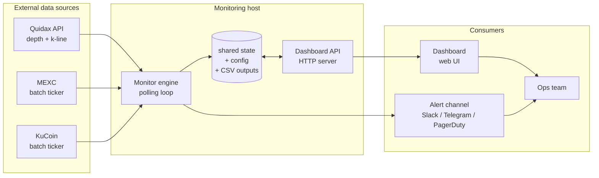
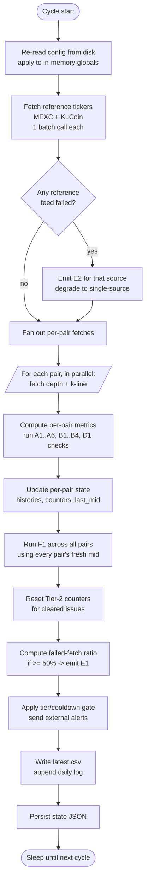
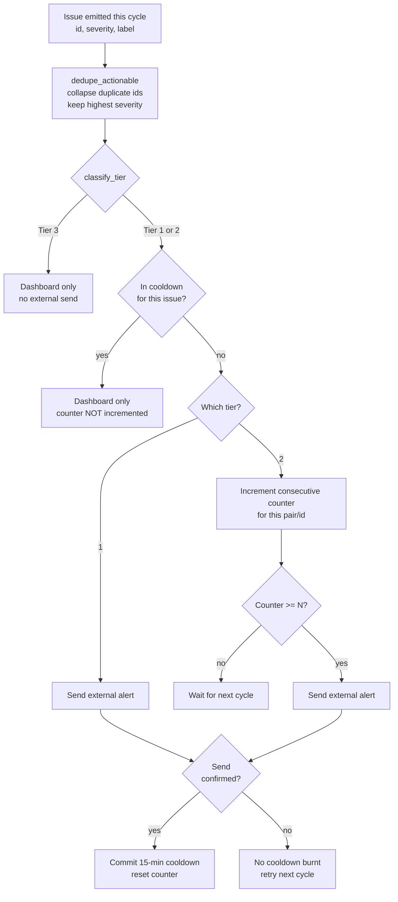
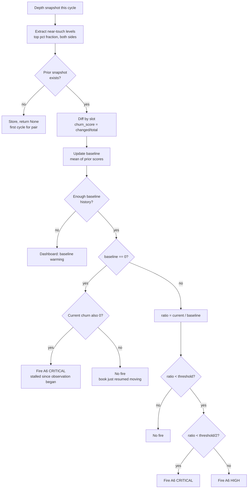
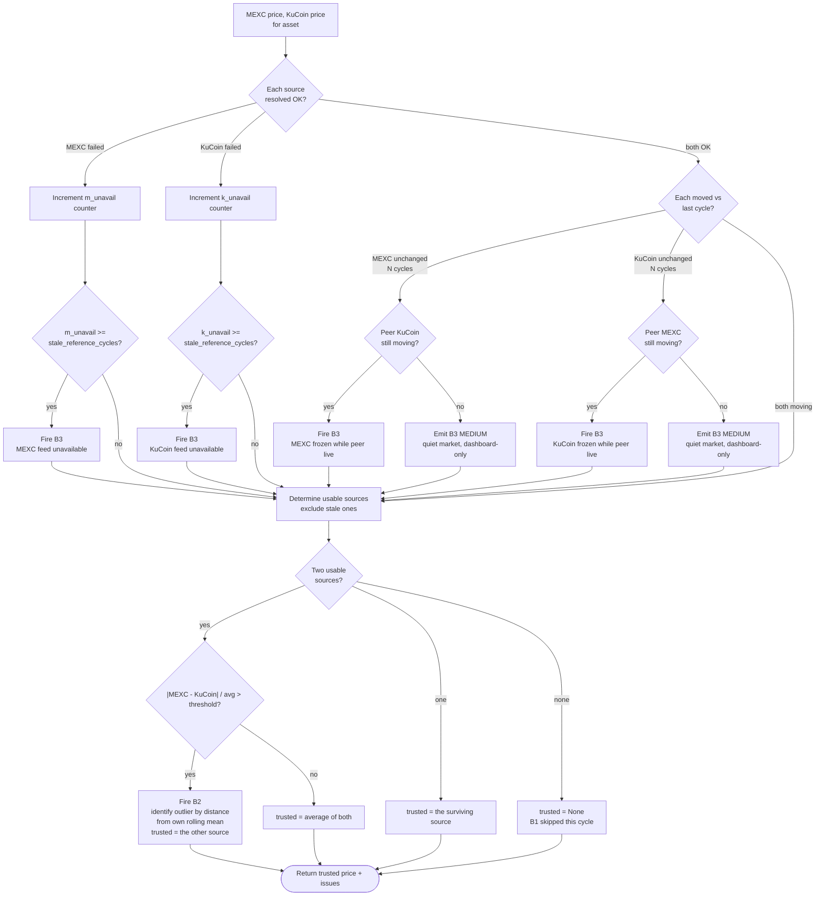
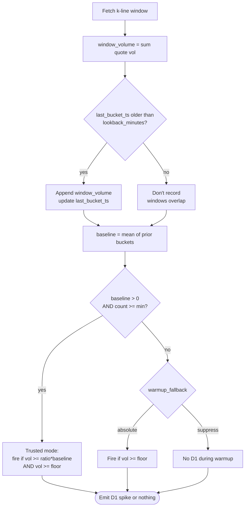

# Orderbook Health Monitor — Engineering Specification

**Audience:** Quidax engineering, for building an in-house implementation.
**Purpose:** Define every alert's detection logic, the data required, the thresholds, the delivery/tiering rules, and the surrounding infrastructure (storage + dashboard).

This document specifies *what* each alert does and *why*; it does not prescribe language or framework. The current reference implementation is Python (asyncio) + FastAPI + a static HTML/JS dashboard, but the design translates cleanly to any stack.

---

## 1. System Overview

The Orderbook Health Monitor (OHM) is a polling loop that:

1. Pulls Quidax orderbook + k-line data for every configured pair on a fixed cadence (60 s by default).
2. Pulls a batch ticker snapshot from two reference exchanges (MEXC, KuCoin) once per cycle.
3. Runs a series of independent checks per pair, producing zero or more `(alert_id, severity, label)` tuples.
4. Applies a delivery policy (tier + cooldown + confirmation counter) to decide whether each alert fires externally or stays on the dashboard.
5. Persists results, per-pair state, and per-cycle CSV outputs, then sleeps until the next cycle.

Two independent processes cooperate via files on shared disk:

- **Monitor engine** — runs the loop above.
- **Dashboard API** — a small HTTP service that reads the same files and exposes them as JSON to the dashboard, plus accepts config edits.



**Why two processes:** the dashboard needs to be responsive and safe to restart; the engine needs to keep polling without interruption. Coupling them via files (rather than in-process shared state) means either can be restarted or replaced without disturbing the other.

---

## 2. The Cycle

Every `cycle_sleep_seconds` (default 60), the engine runs one cycle. All checks operate on the data captured in that cycle — there is no streaming state within a cycle.



Two important properties:

- **Config is re-read every cycle.** Dashboard edits take effect on the next tick with no process restart.
- **State is saved AFTER external sends are confirmed.** Cooldowns are committed on delivery confirmation, so a dropped alert retries next cycle instead of going silent for the whole cooldown window.

---

## 3. Data Inputs

| Source | Endpoint | Per cycle | Used for |
|---|---|---|---|
| Quidax depth | `GET /markets/{symbol}/depth?limit=200` | 1 call **per pair** | A1–A6 (structure), B1 (mid vs reference), F1 (cross-pair mids) |
| Quidax k-line | `GET /markets/{symbol}/k?period=1&limit=60` | 1 call **per pair** | B4 (window move), D1 (rolling volume) |
| MEXC | `GET /api/v3/ticker/price` | 1 batch call total | B1/B2/B3 reference price |
| KuCoin | `GET /api/v1/market/allTickers` | 1 batch call total | B1/B2/B3 reference price |

**Concurrency:** per-pair Quidax fetches run concurrently (bounded, e.g. 10 in flight). Reference calls happen once at the top of the cycle and are shared across all pairs.

**Pair configuration:** each pair carries a symbol, an optional target spread %, and an optional per-exchange alias map for cases where the reference ticker name differs from Quidax's (e.g. Quidax `rndrusdt` → MEXC `RENDER/USDT`).

---

## 4. Alert Tiering & Delivery

Every check emits `(alert_id, severity, label)` tuples. Delivery is decided by a tier classification.

| Tier | Behaviour | Alert IDs |
|---|---|---|
| **1** | Fire on first occurrence; then 15-min cooldown per (pair, alert_id) | A1, A3, A6 (non-monitor-only), D1, B4-CRITICAL, E1, E2 |
| **2** | Fire only after N consecutive cycles of the same issue (default N=3), then 15-min cooldown | A2, B1, B2, B3, B4-HIGH |
| **3** | Dashboard visibility only — never fires external alert | A4, A5, F1, and MEDIUM variants of A6/B3 |

Two subtleties in classification:

- **B4 is severity-split:** CRITICAL (at/beyond the breaker threshold) is Tier 1; HIGH (approaching) is Tier 2.
- **A6 and B3 have MEDIUM variants that route to Tier 3.** These are "visible but silent" cases — an A6 on a monitor-only pair with no bot target, or a B3-unchanged where the peer source is also flat (quiet market, not a dead feed).

### Delivery flow per issue



Three design invariants worth calling out:

1. **Each `(pair, alert_id)` gate is evaluated exactly once per cycle.** Two checks can legitimately emit the same id in one cycle (A2 has spread-widening + shallow-book sub-checks; B3 can fire once per reference source). These are folded before the gate runs, or the confirmation counter double-increments.
2. **Cooldowns are delivery-gated.** They're committed only after the external send is confirmed. A 429/400/transport failure does not burn the window.
3. **Cooldowns are NOT re-armed while active.** If an issue resolves and re-triggers inside the cooldown, the second trigger is dashboard-only; the counter is not advanced.

---

## 5. Alert Specifications

Notation used below:

- `best_ask`, `best_bid` — best (lowest ask / highest bid) price levels from the depth snapshot.
- `mid = (best_ask + best_bid) / 2` — computed from resting limit orders, **not last-traded price**. This distinction matters (see A6).
- `spread_pct = (best_ask - best_bid) / mid * 100`.
- All percent-based thresholds below are dashboard-editable.

### 5.1 Category A — Market Structure

These checks operate purely on the current cycle's depth snapshot.

---

#### A1 — Crossed Orderbook

**Detects:** best bid ≥ best ask.

**Algorithm:**
```
if best_bid >= best_ask:
    fire ("A1", "CRITICAL", ...)
```

**Tier:** 1 (immediate). No confirmation because a crossed book is unambiguous — no threshold to argue with.

**State needed:** none.

---

#### A2 — Bid-Ask Spread Widening (with DWS confirmation) + Shallow Book

Two sub-checks emit under the same alert id; they are deduped before the tier gate.

**Sub-check A: Spread widening vs target**

Fires when a pair has a configured `target_spread` and the current spread deviates severely **and** the depth-weighted spread (DWS) confirms the book is genuinely poor.

```
diff_pct = (current_spread - target) / target * 100
abs_diff_pp = |current_spread - target|
dws_poor = DWS > dws_poor_threshold   # default 0.5

fire A2 if:
    (diff_pct > 100 or diff_pct < -75)
    AND abs_diff_pp >= min_abs_spread_diff_pct   # default 0.05
    AND dws_poor
```

Why the DWS gate: a raw spread number can look "bad" while depth-weighted spread stays healthy — e.g. a wide top-level quote with plenty of liquidity right behind it. Firing on raw spread alone produces false positives on healthy books; DWS confirms structural degradation.

**Sub-check B: Shallow book**

```
fire A2 if ask_layers < min_orderbook_layers OR bid_layers < min_orderbook_layers
     # default min = 10
```

Independent of DWS.

**Tier:** 2 (requires N consecutive confirmations).

**State needed:** consecutive-cycle counter per pair.

---

#### A3 — One-Sided Market

**Detects:** the depth snapshot has zero orders on one side.

**Algorithm:**
```
if asks empty OR bids empty:
    fire ("A3", "CRITICAL", side)
```

**Tier:** 1.

Note: when A3 fires, the rest of the per-pair checks are skipped for that cycle (no mid, no spread, no meaningful A6 snapshot). Do not store empty/partial layer snapshots because it corrupts the churn baseline for A6.

---

#### A4 — Thin Mid-Market

**Detects:** total quote-currency liquidity within ±25% of the current spread band around mid is below a floor.

**Algorithm:**
```
depth_25 = sum(amount * price for levels within (mid ± 1.25 * spread))
if 0 < depth_25 < thin_depth_threshold:   # default 5,000
    fire ("A4", "MEDIUM", ...)
```

**Tier:** 3 (dashboard-only).

---

#### A5 — Depth Imbalance

**Detects:** one side has substantially more depth than the other, within the near-mid band.

**Algorithm:**
```
imbalance_ratio = max(ask_depth, bid_depth) / min(ask_depth, bid_depth)
    # within (mid ± 1.25 * spread)

if imbalance_ratio == inf:                    # all depth on one side
    fire ("A5", "HIGH")
elif imbalance_ratio >= depth_imbalance_ratio:   # default 5.0
    fire ("A5", "MEDIUM")
```

**Tier:** 3.

---

#### A6 — Layer Churn Stall

**Detects:** near-touch price levels have stopped refreshing relative to how much this pair *normally* churns. Uses a **per-pair self-baseline**, not a global threshold — busy markets naturally have more churn than quiet ones.

**Distinct from B3:** B3 detects a dead upstream reference feed connection; A6 detects a live Quidax feed whose *content* has stopped moving. The API keeps returning fresh 200 OKs; the book itself is frozen.

**Per-cycle computation:**
1. Extract "near-touch" layers: the top `top_pct` (default 0.5, i.e. nearest half) of each side, ordered nearest-to-mid.
2. Diff against the previous cycle's snapshot for the same pair — count how many `(price, amount)` slots changed on each side.
3. `churn_score = changed_slots / total_slots` (both sides combined). Returns `None` on a pair's first-ever cycle.
4. Update the per-pair rolling baseline of churn scores over the last `baseline_buckets` cycles (default 20). The current reading is excluded from its own baseline.

**Firing:**

```
if bucket_count < min_history_buckets:
    return               # baseline still warming

if baseline == 0:
    # Special case: pair has been fully stalled since we started watching.
    # A baseline built entirely from the stall looks "normal" — the ratio
    # can never fire because there's no non-stalled period to compare against.
    if current_churn == 0:
        if monitor_only:
            fire ("A6", "MEDIUM", ...)      # dashboard-only (no bot on this pair)
        else:
            fire ("A6", "CRITICAL", ...)    # book stalled since observation began
    return

ratio = current_churn / baseline
if ratio < ratio_threshold:                 # default 0.2
    severity = "CRITICAL" if ratio < threshold/2 else "HIGH"
    fire ("A6", severity, ...)
```

**Tier:** 1 (except the MEDIUM monitor-only variant, which is Tier 3).

**State needed (persisted per pair):**
- Last cycle's near-touch snapshot (both sides).
- Rolling list of prior churn scores (up to `baseline_buckets`).

**Implementation gotcha:** the snapshot round-trips through JSON, so store levels as lists (not tuples). `[1,2] != (1,2)` in Python — comparing a freshly-built tuple against a reloaded list will silently register 100% churn every cycle.



---

### 5.2 Category B — Pricing

B1/B2/B3 require an external reference exchange price. **They run only for USDT-quoted pairs**, because MEXC/KuCoin don't list NGN or GHS pairs. NGN/GHS pairs are covered by F1 via triangulation instead.

B4 is reference-free — it uses Quidax's own k-line window.

---

#### Reference resolution (B2/B3 combined pipeline)

Before B1 can run, both reference prices for the asset are pulled from the batched ticker snapshots. A per-asset resolver decides whether each source is usable, emits B3 if stale, then compares the survivors and emits B2 if they disagree.



#### B3 — Stale Reference Price Feed

Two structurally different failures, tracked with two separate counters, both surfaced under the id B3:

1. **UNAVAILABLE** — the source didn't resolve at all (API error, unlisted symbol, wrong alias). Fires once `m_unavail` (or `k_unavail`) reaches `stale_reference_cycles` (default 3). Severity escalates to CRITICAL at 2× that count.

2. **UNCHANGED with cross-source liveness gate** — the source resolved but returned a price within `stale_movement_epsilon_pct` of last cycle (default 0.0 = exact equality). After `stale_unchanged_cycles` (default 5), consult the peer source:
   - Peer moving → real stale feed. Fire B3 HIGH (CRITICAL at 2× count).
   - Peer flat or absent → quiet market or single-source asset. Emit B3 **MEDIUM** → routes to Tier 3 (dashboard-only).

Why the cross-source gate: an unchanged price alone is not evidence of a dead feed — quiet markets naturally sit flat. Firing on any unchanged reading produces massive noise on low-vol pairs.

**Tier:** 2 (except the MEDIUM peer-flat variant, which is Tier 3).

**State needed per asset:** rolling price history from each source (used for both liveness detection and outlier identification in B2), plus the four counters (`m_unavail`, `k_unavail`, `m_unchanged`, `k_unchanged`), plus `m_ever_ok` / `k_ever_ok` flags (an UNCHANGED alert requires the source to have worked at least once, or we can't tell "stale" from "never worked").

---

#### B2 — Source Exchange Divergence

After stale sources are excluded, if two usable sources remain:

```
divergence_pct = |mexc - kucoin| / avg(mexc, kucoin) * 100
if divergence_pct > source_divergence_pct:   # default 0.3
    outlier = whichever is farther from its own rolling mean
    trusted = the other source
    fire ("B2", "HIGH", ...)
else:
    trusted = avg(mexc, kucoin)
```

**Tier:** 2. **State needed:** rolling per-source price history (already maintained for B3).

---

#### B1 — Price Discrepancy (Quidax vs Trusted Reference)

USDT-quoted pairs only. Runs after reference resolution has produced a `trusted_price`.

The LM bot doesn't quote symmetrically around the reference — it applies the target spread as a markup, so the Quidax mid normally sits ~`target_spread / 2` away from the reference **by design**. B1 must be additive on top of that:

```
expected_offset = (target_spread or 0) / 2
diff_pct = |quidax_mid - trusted_price| / trusted_price * 100
if diff_pct > expected_offset + price_discrepancy_pct:   # default 0.5 extra
    fire ("B1", "HIGH", ...)
```

Flat global thresholds fire constantly on pairs with legitimate bot-applied offsets. This formulation aligns per-pair.

**Tier:** 2. **State needed:** none beyond what B2/B3 already track.

---

#### B4 — Circuit Breaker Proximity

Reference-free — uses Quidax's own k-line window.

```
window_open = open price of oldest candle in the lookback window
move_pct = (current_mid - window_open) / window_open * 100

warn_level = circuit_breaker_pct * circuit_breaker_warn_ratio    # default 10.0 * 0.8 = 8.0
if |move_pct| >= circuit_breaker_pct:
    fire ("B4", "CRITICAL", ...)         # Tier 1
elif |move_pct| >= warn_level:
    fire ("B4", "HIGH", ...)             # Tier 2
```

**Tier:** severity-split (CRITICAL → Tier 1, HIGH → Tier 2). **State needed:** none.

---

### 5.3 Category D — Volume

#### D1 — Volume Spike

Fires when a pair's rolling-window volume is unusually large **for that pair**, not just large in absolute terms.

**Per-cycle computation:**
1. `window_volume` = sum of quote-volume from the last `lookback_minutes` of 1-minute candles.
2. Update the per-pair volume baseline: record a new bucket only once every `lookback_minutes` of real elapsed time. This matters — with a 60 s cycle and a 60 min lookback, consecutive cycles' windows overlap ~59/60. Recording every cycle would average near-identical readings against themselves.
3. `baseline` = mean of the previous `volume_baseline_buckets` recorded windows (excluding the just-recorded one).

**Firing (mode = `baseline_relative`, the default):**

```
baseline_trusted = (baseline > 0 AND bucket_count >= min_baseline_buckets)

if baseline_trusted:
    fire D1 if window_volume >= spike_ratio * baseline
                AND window_volume >= per_pair_absolute_floor
else:
    # warm-up phase (fresh install, or state wipe)
    if warmup_fallback == "absolute":
        fire D1 if window_volume >= per_pair_absolute_floor
    elif warmup_fallback == "suppress":
        no D1 fires until baseline is trusted
```

**Why the absolute floor:** without it, a pair doing 3× a tiny baseline fires D1 with no economic significance. Without the baseline component, a busy pair whose normal volume already clears the flat threshold fires every single cycle. Both gates must pass.

**Mode = `absolute`:** bypass the baseline entirely, use only the floor. Provided as an escape hatch for fast rollback without redeploy.

**Tier:** 1. **State needed:** per-pair rolling volume buckets + last-bucket timestamp.



---

### 5.4 Category E — Connectivity

These are global (per-cycle) rather than per-pair.

---

#### E1 — Quidax API Response Failure

**Detects:** a large fraction of per-pair Quidax fetches failed in this cycle.

```
failure_ratio = failed_pair_count / total_pair_count
if failure_ratio >= FAILED_PAIR_RATIO_FOR_OUTAGE_ALERT:    # default 0.5
    fire E1 (once, subject to 15-min cooldown on the global "E1" key)
```

Isolated per-pair fetch failures don't fire — only when it looks like an outage. Individual per-pair failures are logged but the per-pair check row for that pair is simply absent from the cycle's results.

**Tier:** 1 (with its own global cooldown key, separate from per-pair alerts).

---

#### E2 — Reference Feed Disconnect

**Detects:** the batch call to MEXC or KuCoin failed at the transport layer.

```
for each reference source:
    try:
        fetch batch tickers
    except:
        emit ("E2", "CRITICAL", source_name)
        # B1/B2/B3 checks that depend on this source degrade gracefully
```

**Tier:** 1 (global cooldown key).

Downstream effect: B2 falls back to single-source or drops the trusted price entirely if both sides are down; B1 skips silently when there's no `trusted_price`.

---

### 5.5 Category F — Cross-Market

#### F1 — Cross-Pair Arbitrage Gap

Uses triangulation across pairs the engine is already fetching — no additional network cost.

**Triangle discovery** (run once per cycle after config reload):

- **Base bridge**: for every `XNGN` pair (X ≠ USDT, CNGN), if `XUSDT` and `USDTNGN` are both configured, then `XNGN` should ≈ `XUSDT * USDTNGN`.
- **Quote bridge**: `CNGNNGN` should ≈ `USDTNGN / USDTCNGN`.

**Firing:**

```
for each triangle:
    implied = leg_A * leg_B      (base bridge) or leg_A / leg_B (quote bridge)
    gap_pct = (direct_mid - implied) / implied * 100
    if |gap_pct| >= arb_gap_pct:   # default 0.5
        severity = HIGH if |gap_pct| >= 2 * arb_gap_pct else MEDIUM
        # Root-cause attribution: if a leg already fired B1 this cycle,
        # that leg is the suspect; otherwise, the direct pair itself.
        emit F1
```

**Tier:** 3 (dashboard-only). F1 is diagnostic — it points at *which pair* is likely misquoted, but the actionable follow-up is usually a B1/A6 investigation on the suspect leg.

**Runs after all per-pair checks** because it needs every pair's fresh mid in hand.

---

## 6. Data Storage

The engine and the API cooperate via files on shared disk. There is no database.

| File | Written by | Read by | Contents |
|---|---|---|---|
| `latest.csv` | engine, end of every cycle | API | One row per pair, current cycle's full metrics |
| `daily_log_{YYYY-MM-DD}.csv` | engine, append-only | API | One row per warning market per cycle (healthy pairs skipped) |
| `health_state.json` | engine, after external sends | API | Per-pair cooldowns, consecutive counters, rolling histories (reference prices, volume, layer churn), last observed mid + timestamp, global cooldowns |
| `monitor_config.json` | API, on config edit | engine | Threshold overrides (partial doc; layered over shared defaults) |

### Config sharing

Both processes import the same canonical `DEFAULT_CONFIG` and merge helper. A stored `monitor_config.json` is deep-merged over the defaults; a partial edit fills only what it names. Neither process caches config across cycles — the engine re-reads on every tick, the API re-reads on every request. This guarantees the two processes cannot drift on what the defaults are or how partial overrides are layered.

### State persistence

`health_state.json` structure (per-pair, keyed by symbol, plus a `_global` bucket for E1/E2 cooldowns):

```
{
  "btcusdt": {
    "_alert": {
      "A2": { "consecutive": 2, "cooldown_until": "2026-07-02T12:15:00+01:00" },
      "B1": { "consecutive": 0 }
    },
    "last_mid": 64123.5,
    "last_mid_ts": "2026-07-02T12:03:00+01:00",
    "_ref_hist": {
      "mexc":       [64100.0, 64110.5, 64120.1, ...],
      "kucoin":     [64099.0, 64108.5, 64118.3, ...],
      "m_unavail": 0, "k_unavail": 0,
      "m_unchanged": 0, "k_unchanged": 0,
      "m_ever_ok": true, "k_ever_ok": true
    },
    "_vol_hist":   { "buckets": [1_234_000, 1_180_000, ...], "last_bucket_ts": "..." },
    "_layer_hist": { "last_top_asks": [[64125,0.3],...], "last_top_bids": [...],
                     "churn_scores": [0.6, 0.55, ...] }
  },
  "_global": {
    "_alert": {
      "E1": { "cooldown_until": "..." },
      "E2": { "cooldown_until": "..." }
    }
  }
}
```

Two properties worth guarding in any reimplementation:

- **Save state AFTER external sends complete**, not before. Otherwise a crash mid-send loses the cooldowns you just wrote and the alert re-fires on the next restart.
- **`last_mid_ts` is only stamped for pairs that returned a numeric mid this cycle.** A one-sided book (A3) or a failed fetch leaves the previous stamp untouched. The gap between `last_mid_ts` and now becomes exactly the duration the pair's mid has been unobservable — cheap and correct.

---

## 7. Dashboard

The dashboard is a single-page HTML/JS app polling the API on a fixed interval. Everything is client-side rendering from JSON — no server-side templates, no live push.

### Endpoints consumed

| Endpoint | Poll interval | Purpose |
|---|---|---|
| `GET /api/status` | 60 s | Current cycle: all pairs with their metrics + a summary block |
| `GET /api/history` | 60 s | Today's daily log (or a specified date, up to 30 days back) |
| `GET /api/state` | on-demand | Raw state for debugging / detail panel |
| `GET /api/config` | on config panel open | Merged config for the edit form |
| `POST /api/config` | on save | Persist edited config |

### Screens

**Overview grid.** One row per pair. Colour-coded by worst active issue tier. Columns: symbol, mid, spread%, target spread, DWS, layer counts, imbalance ratio, layer churn vs baseline, D1 window volume vs threshold, active issue ids, and whether an external alert fired this cycle.

**Detail panel** (click a pair). Runs every check as a pass/fail/N-A row for that pair, with the relevant numbers and thresholds inline. Includes a small spread-history sparkline pulled from the daily log for that pair. This is the operator's diagnostic view — it shows *why* a pair is or isn't alerting.

**Daily log.** Filterable/paginated table of all warning rows for the selected date. Downloadable as CSV.

**Config panel.** Every threshold in the system, grouped by section (timing / orderbook / pricing / kline / volume spike / layer churn / pairs). Freeform numeric inputs — no client-side clamps. Saves POST to the API; new values take effect on the engine's next cycle (no restart). "Reset to defaults" button clears the override file.

### Rendering rules worth preserving

- **Any alert-emitting condition is coloured based on its tier**, not just the raw metric. A Tier-3 issue is visible but styled as informational; a Tier-1 issue is a hard warning. This keeps operator attention aligned with the delivery policy.
- **Baseline-driven checks (A6, D1) render "warming" states explicitly.** If the baseline hasn't accumulated enough history yet, the row shows N/A rather than a false-positive pass. This matters most right after a state wipe.
- **N/A vs FAIL are different colours.** "No external reference for this NGN pair" (B1/B2/B3 are structurally inapplicable) is not the same as "the check failed".

---

## 8. Reference Configuration

Defaults, all dashboard-editable:

```
timing:
  cycle_sleep_seconds: 60

orderbook:
  depth_limit: 200
  min_orderbook_layers: 10
  thin_depth_threshold: 5000
  depth_imbalance_ratio: 5.0
  dws_poor_threshold: 0.5
  min_abs_spread_diff_pct: 0.05

pricing:
  price_discrepancy_pct: 0.5          # B1 (additive over target/2)
  source_divergence_pct: 0.3          # B2
  stale_reference_cycles: 3           # B3 unavailable count
  stale_unchanged_cycles: 5           # B3 unchanged count
  stale_movement_epsilon_pct: 0.0     # B3 "unchanged" tolerance
  circuit_breaker_pct: 10.0           # B4
  circuit_breaker_warn_ratio: 0.8
  arb_gap_pct: 0.5                    # F1

kline:
  candle_minutes: 1
  lookback_minutes: 60
  volume_baseline_buckets: 24         # D1 baseline sample count

volume_spike:
  mode: baseline_relative             # or "absolute"
  spike_ratio: 3.0                    # D1 fires when vol >= this * baseline
  min_baseline_buckets: 4             # trust gate for baseline
  warmup_fallback: absolute           # or "suppress"

layer_churn:
  top_pct: 0.5                        # A6 near-touch fraction
  baseline_buckets: 20
  ratio_threshold: 0.2                # A6 fires below this fraction of baseline

# Alert delivery
tier2_confirm_cycles: 3
alert_cooldown_minutes: 15
failed_pair_ratio_for_e1: 0.5
```

---

## 9. Scope Boundaries

The following alerts commonly appear in market-monitoring literature but are **explicitly out of scope** for this system because they require telemetry the OHM does not have access to via public REST endpoints:

- **C1 — LM Bot Stale.** Needs direct bot process telemetry.
- **C2 — LM Bot Inventory Skew.** Needs bot position data.
- **C3 — LM Bot Order Size Drift.** Needs bot configuration + placed-order history.
- **E3 — LM Bot Feed Heartbeat Loss.** Needs a heartbeat channel from the bot.

If an in-house implementation has access to bot telemetry (which the OHM does not), these become straightforward additions to the same tier/cooldown/dedupe infrastructure — they just tap a different data source.
